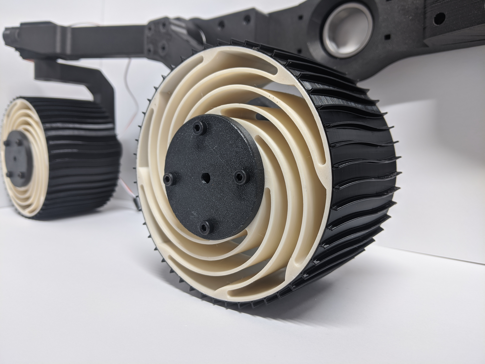
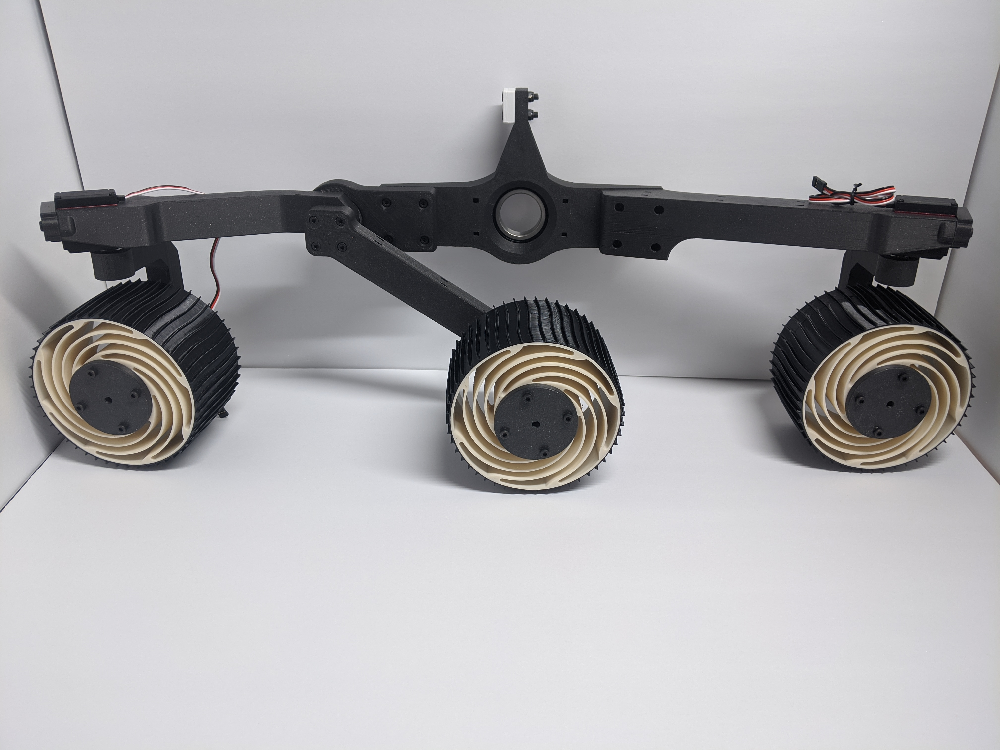

# 3D PRINTED ARDUINO ROVER PROJECT
.
## First motion. January 28th 2020
In need of some serious alignment but all 4 steering servos are working as expected.
<iframe src="https://drive.google.com/file/d/1EWGRO3_IIOmERbgHRsVMHJXDeMzIxA6N/preview" width="800" height="1000"></iframe>

## Pictures from January 2020
## State of the CAD assembly as of late January 2020

### First fresh set of tires installed

.
## 3D print timelapses from January 2020
### Differential bar
<iframe src="https://giphy.com/embed/YRcTnL8hbE6Wi8lrla" width="800" height="600" frameBorder="0" class="giphy-embed" allowFullScreen></iframe>
### Center belly chassis plate
<iframe src="https://giphy.com/embed/Kx8tmRcTgeUY38PBqj" width="800" height="600" frameBorder="0" class="giphy-embed" allowFullScreen></iframe>
### First successful tire. Made of NINJAFLEX
<iframe src="https://giphy.com/embed/gKNfcxjXC3zx1pa01F" width="800" height="450" frameBorder="0" class="giphy-embed" allowFullScreen></iframe>
### Mobility hub
<iframe src="https://giphy.com/embed/j3nBfI55rta3PTU4oi" width="800" height="450" frameBorder="0" class="giphy-embed" allowFullScreen></iframe>
### Drive motor mounts
<iframe src="https://giphy.com/embed/XBubGuu9Q5351YPY6j" width="800" height="450" frameBorder="0" class="giphy-embed" allowFullScreen></iframe>
### Rear mobility arm
<iframe src="https://giphy.com/embed/JpS6J3BygAjSKsUs1J" width="800" height="450" frameBorder="0" class="giphy-embed" allowFullScreen></iframe>
.
## 3D print timelapses from December 2019
### Rim
<iframe src="https://giphy.com/embed/USs3zfmjgtTSIVOs8Z" width="800" height="450" frameBorder="0" class="giphy-embed" allowFullScreen></iframe>
### Rim mounts
<iframe src="https://giphy.com/embed/fWrD8k0yxPMyoSrpLK" width="800" height="450" frameBorder="0" class="giphy-embed" allowFullScreen></iframe>
<a href="https://giphy.com/gifs/fWrD8k0yxPMyoSrpLK">via GIPHY</a>

.
## Pictures from December 2019
### Wheels have a spiraled spoke design similar to MER
 
### Size comparison to my first rover
 
### Current state of the CAD assembly. Other mobility side is not included due to mirroring issues in Fusion 360

