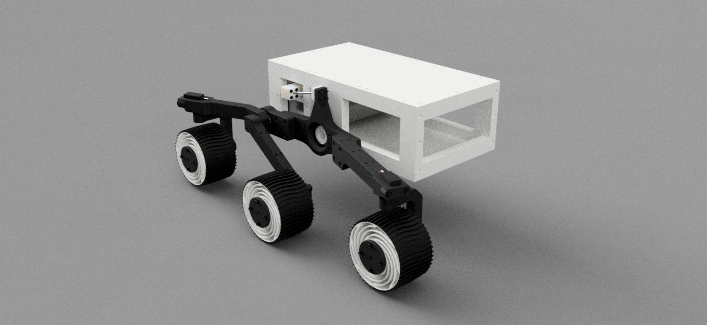

# 3D PRINTED ARDUINO ROVER PROJECT
.
### If you feel like donating to the project, it would be greatly appreciated. If not enjoy all of the pictures and timelapses. The site will be updated regularly.
<form action="https://www.paypal.com/cgi-bin/webscr" method="post" target="_top">
<input type="hidden" name="cmd" value="_s-xclick" />
<input type="hidden" name="hosted_button_id" value="75KGASXHSWN5C" />
<input type="image" src="https://www.paypalobjects.com/en_US/i/btn/btn_donateCC_LG.gif" border="0" name="submit" title="PayPal - The safer, easier way to pay online!" alt="Donate with PayPal button" />

</form>
.
## Pictures from January 2020
### First fresh set of tires installed

.
## 3D print timelapses from January 2020
### First successful tire. Made of NINJAFLEX
<iframe src="https://giphy.com/embed/gKNfcxjXC3zx1pa01F" width="800" height="450" frameBorder="0" class="giphy-embed" allowFullScreen></iframe>
### Mobility hub
<iframe src="https://giphy.com/embed/j3nBfI55rta3PTU4oi" width="800" height="450" frameBorder="0" class="giphy-embed" allowFullScreen></iframe>
### Drive motor mounts
<iframe src="https://giphy.com/embed/XBubGuu9Q5351YPY6j" width="800" height="450" frameBorder="0" class="giphy-embed" allowFullScreen></iframe>
### Rear mobility arm
<iframe src="https://giphy.com/embed/JpS6J3BygAjSKsUs1J" width="800" height="450" frameBorder="0" class="giphy-embed" allowFullScreen></iframe>
.
## 3D print timelapses from December 2019
### Rim
<iframe src="https://giphy.com/embed/USs3zfmjgtTSIVOs8Z" width="800" height="450" frameBorder="0" class="giphy-embed" allowFullScreen></iframe>
### Rim mounts
<iframe src="https://giphy.com/embed/fWrD8k0yxPMyoSrpLK" width="800" height="450" frameBorder="0" class="giphy-embed" allowFullScreen></iframe>
<a href="https://giphy.com/gifs/fWrD8k0yxPMyoSrpLK">via GIPHY</a>

.
## Pictures from December 2019
### Wheels have a spiraled spoke design similar to MER
 
### Size comparison to my first rover
 
### Current state of the CAD assembly. Other mobility side is not included due to mirroring issues in Fusion 360

